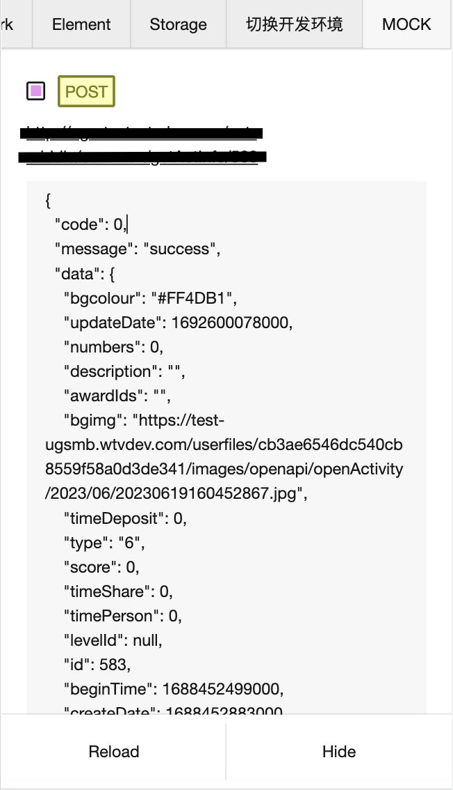

## vConsole MockXHR Plugin

[](https://github.com/EduarteXD/vconsole-mock-xhr/actions/workflows/npm-publish.yml)



vConsole Mock XMLHttpRequest 请求插件

### Usage

```
npm install vconsole-mock-xhr
// or
yarn add vconsole-mock-xhr
// or
pnpm install vconsole-mock-xhr
```

在程序入口

```typescript
import vconsole from 'vconsole'

import 'vconsole-mock-xhr/style.css'
import { createMockXHRPlugin } from 'vconsole-mock-xhr'

const vc = new vconsole()
vc.addPlugin(createMockXHRPlugin())
```
